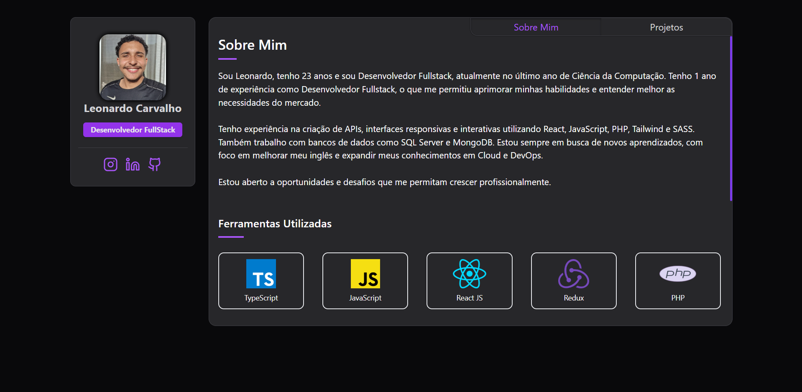

# 👨‍💻 Leonardo R. Carvalho

  

  
  

---

## 🧠 Sobre Mim

Desenvolvedor Fullstack completamente interessado tecnologia e inovação. Possuo experiência com desenvolvimento web, mobile e integração de sistemas. Muito bom em criar soluções eficientes e escaláveis, sempre focado em boas práticas e melhoria contínua.

- 🔭 Atualmente trabalhando como **Desenvolvedor Web** no **Grupo Anchieta**
- 🌱 Aprendendo **DevOps, CI/CD e Cloud Computing**
- 👯 Procurando colaborar em **Prjetos Freelancer**
- 💬 Pergunte-me sobre **Programação, Sistemas Operacionais, DevOps**

---

## 🌐 Portfolio

  

---

## 🚀 Tecnologias e Habilidades

  
  ### Linguagens de Programação
  

    
    
    
    
  

  
  ### Frontend
  

    
    
    
    
    
  

  
  ### Banco de Dados
  

    
    
    
  

  
  ### DevOps & Ferramentas
  

    
    
    
    
  

---

## 📊 GitHub Stats

  

---

## 🎓 Cursos & Certificações

  
  

      <h3>Certificações</h3>
      
  

## 🎓 Formação Acadêmica

**Bacharelado em Ciências da Computação** @ Grupo Anchieta _(Jan 2022 - Dez 2025)_

- Foco em: Progração FullStack e Integração e entrega contínuas (CI/CD)
- Áreas de estudo: Algoritmos, Estrutura de Dados, Desenvolvimento Web, Banco de Dados, Redes
- Tecnologias aprendidas: JavaScript, PHP, Python, SQL Server, MongoDB, Git, CI/CD

## 💼 Experiência Profissional

**Desenvolvedor Web** @ Grupo Anchieta _(2024 - Presente)_

- Desenvolvimento e manutenção de aplicações web utilizando React, Node.js e SQL Server
- Automação de processos e integração de sistemas
- Tecnologias: React, Node.js, SQL Server, Git, TypeScript, JavaScript, PHP

---

  

  

  💡 Sempre buscando evoluir como Dev e como pessoa. Pronto para o próximo desafio!

